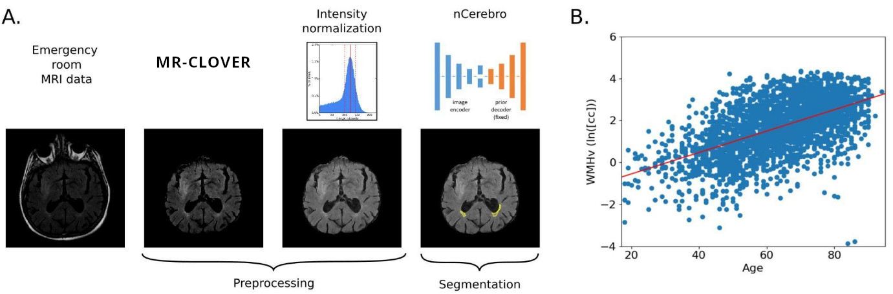

# WMHP - White Matter Hyperintensity Pipeline

A streamlined Python pipeline for WMH segmentation from clinical FLAIR MRI.

## Version 1.0.0

Major refactor: Modular Python package replacing the shell script wrapper.

## Goal

We set out to characterize white matter hyperintensity lesions in large scale acute ischemic stroke cohorts.

An overview of the goals and the process of the algorithm can be found here:
http://markus-schirmer.com/artemis_aim_1.html

See also:
http://www.resilientbrain.org/mrigenie.html

This is what the pipeline looks like:



## Use Restriction

Feel free to use for scientific purposes and please acknowledge our work:

Citation for WMH segmentation:
> Schirmer et al. "White matter hyperintensity quantification in large-scale clinical acute ischemic stroke cohorts–The MRI-GENIE study." *NeuroImage: Clinical* 23 (2019): 101884.

Citation using brain volume estimates:
> Alhadid et al. "Brain volume is a better biomarker of outcomes in ischemic stroke compared to brain atrophy." Frontiers in Stroke 3 (2024): 1468772.

The atlas included in this pipeline is from our other work found here:
> Schirmer et al. "Spatial signature of white matter hyperintensities in stroke patients." *Frontiers in neurology* 10 (2019): 208.
>
> https://zenodo.org/record/3379848#.ZBMns9LMLcI

## Installation

```bash
# Install dependencies
pip install numpy nibabel scipy scikit-image antspyx

# Or using the requirements file
pip install -r requirements.txt

# FreeSurfer must be installed for SynthSeg
# ANTs must be installed for registration
```

This project, although developed with the use of GPUs, can be readily evaluated on CPUs only. Should not take much longer than 1 min per patient.

## Downloads

Within the folder nCerebro, please put the following files in a folder called `fixtures`:

https://www.dropbox.com/sh/ksjfog2cbl69b6s/AAA-hmRb5TYcnLlKsvczuUZ4a?dl=0

→ `nCerebro/fixtures`

## Data

The pipeline requires NIfTI files as input, specifically `.nii.gz`. If you are working with DICOM files, we recommend [dcm2niix](https://github.com/rordenlab/dcm2niix) to convert your DICOM images to NIfTI.

### Input
Clinical FLAIR image (around 1×1×6mm resolution) of stroke patients.

### Output
Main outputs include:
- **WMH segmentation** — `*_wmh_seg.nii.gz`
- **Brain mask** — `*_wmh_seg_brainmask_01.nii.gz`
- **Refined brain mask** (combined GM & WM) — `*_wmh_seg_gmwm_seg.nii.gz`
- **Statistics log** — `*_wmh_seg_stats.log` (rescaling factor, GMWM volume, WMH volume)

Results and intermediate files (if kept) will be saved in the output file's directory.

## Project Structure

```
wmhp/
├── wmhp.py              # Entry point + pipeline logic
├── mr_clover.py         # Brain extraction (standalone, untouched)
├── preprocessing.py     # Helpers for bias/normalization
├── registration.py      # ANTs registration wrappers
├── utils.py             # Logging, I/O helpers, NIfTI operations
├── nCerebro/            # WMH segmentation model
│   ├── cerebro.py
│   ├── fixtures/
│   │   ├── iso_flair_template_intres_brain.nii.gz
│   │   └── new_to_old0GenericAffine.mat
│   └── trained/
│       ├── model.hdf5
│       └── tmp_*.hdf5
├── atlas/               # Registration atlas
│   └── caa_flair_in_mni_template_smooth_brain_intres.nii.gz
├── README.md
└── requirements.txt
```

## Usage

### Command Line

```bash
# Direct execution (like the old wmhp.sh)
./wmhp.py -i flair.nii.gz -o wmh.nii.gz

# Or with python explicitly
python wmhp.py -i flair.nii.gz -o wmh.nii.gz

# With additional outputs
python wmhp.py -i flair.nii.gz -o wmh.nii.gz \
    --brain brain.nii.gz \
    --norm normalized.nii.gz \
    --stats volumes.csv \
    -v  # verbose

# Using pre-computed MR-CLOVER outputs (skip preprocessing)
python wmhp.py -i flair.nii.gz -o wmh.nii.gz \
    --gmwm-mask gmwm.nii.gz \
    --bias-field bias.nii.gz \
    --mr-clover-stats stats.csv

# Force CPU processing
python wmhp.py -i flair.nii.gz -o wmh.nii.gz --cpu

# Custom paths (if nCerebro/atlas are elsewhere)
python wmhp.py -i flair.nii.gz -o wmh.nii.gz \
    --ncerebro /path/to/cerebro.py \
    --atlas /path/to/atlas.nii.gz
```

This project, although developed with the use of GPUs, can be readily evaluated on CPUs only. Should not take much longer than 1 min per patient.

### Python API

```python
from wmhp import process, preprocess, PreprocessingResult
from wmhp import register_to_atlas, binarize
from wmhp import Log

# Configure logging
Log.configure(verbose=True)

# Run full pipeline
import argparse
args = argparse.Namespace(
    input='flair.nii.gz',
    output='wmh.nii.gz',
    subject='sub001',
    # ... other options
)
exit_code = process(args)

# Or use individual components
result = preprocess(
    input_path='flair.nii.gz',
    output_gmwm='gmwm.nii.gz',
    output_brain='brain.nii.gz',
    output_norm='normalized.nii.gz',
    output_stats='stats.csv'
)

print(f"WM mode: {result.wm_mode}")
print(f"Brain volume: {result.brain_volume_mm3 / 1000:.1f} cm³")
```

## Pipeline Steps

1. **Preprocessing** (`preprocessing.py`)
   - N4 bias field correction (ANTs)
   - SynthSeg brain segmentation (FreeSurfer)
   - Extract masks: brain, GMWM, ICV, ventricles
   - Intensity normalization (mean-shift mode finding)

2. **Registration** (`registration.py`)
   - ANTs affine registration to atlas
   - Legacy atlas transform for nCerebro compatibility

3. **WMH Segmentation** (`nCerebro/cerebro.py`)
   - Deep learning-based segmentation
   - Runs on atlas-registered brain

4. **Post-processing**
   - Inverse transform to subject space
   - Binarization with threshold

## Options

| Option | Default | Description |
|--------|---------|-------------|
| `-i, --input` | required | Input FLAIR image |
| `-o, --output` | required | Output WMH mask |
| `-s, --subject` | from filename | Subject ID |
| `-t, --threads` | 20 | CPU threads |
| `-T, --threshold` | 0.5 | WMH binarization threshold |
| `--norm-target` | 0.75 | Target WM intensity |
| `--cpu` | False | Force CPU (GPU default) |
| `--robust` | False | SynthSeg robust mode |
| `-f, --force` | False | Force overwrite |
| `-k, --keep` | False | Keep temp files |
| `-v, --verbose` | False | Verbose output |
| `-q, --quiet` | False | Minimal output |

## Migration from v2.x (shell script)

The Python package provides equivalent functionality to `wmhp.sh`:

| Old (shell) | New (Python) |
|-------------|--------------|
| `./wmhp.sh -i ... -o ...` | `./wmhp.py -i ... -o ...` |
| `--brain FILE` | `--brain FILE` |
| `--norm FILE` | `--norm FILE` |
| `--gmwm FILE` | `--gmwm FILE` |
| `--stats FILE` | `--stats FILE` |
| `--gmwm-mask FILE` | `--gmwm-mask FILE` |
| `--bias-field FILE` | `--bias-field FILE` |
| `--mr-clover-stats FILE` | `--mr-clover-stats FILE` |

**Key differences:**
- Pure Python (no shell script wrapper)
- Modular design for programmatic use
- Better error handling and logging
- Self-contained: nCerebro and atlas are inside the package
- Compatible with existing nCerebro (unchanged)

## Module Reference

### `wmhp.py`

Main entry point — run the full WMH pipeline:
```bash
./wmhp.py -i flair.nii.gz -o wmh.nii.gz
```

### `mr_clover.py` (standalone)

Brain extraction and tissue segmentation. Run directly:
```bash
python mr_clover.py -i scan.nii.gz -o gmwm.nii.gz --brain brain.nii.gz --stats stats.csv
```

### `wmhp.preprocessing`

- `run_mr_clover()` — Call mr_clover.py as subprocess
- `apply_bias_correction()` — Apply pre-computed bias field
- `apply_bias_and_normalize()` — Bias + WM normalization
- `create_brain_matchwm()` — Create masked normalized brain

### `wmhp.registration`

- `register_to_atlas()` — ANTs registration
- `apply_transform()` — Apply transforms
- `apply_inverse_transform()` — Inverse transform

### `wmhp.utils`

- `Log` — Color-coded logging
- `binarize()` — Threshold images
- `upsample()`, `downsample()` — Resolution changes
- `read_stats_csv()`, `write_stats_csv()` — CSV I/O

## Dependencies

- Python ≥3.9
- numpy
- nibabel
- scipy
- scikit-image
- antspyx
- FreeSurfer (for SynthSeg)
- ANTs (for registration)

## License

See LICENSE file.

## Contact

MDS — mschirmer1@mgh.harvard.edu