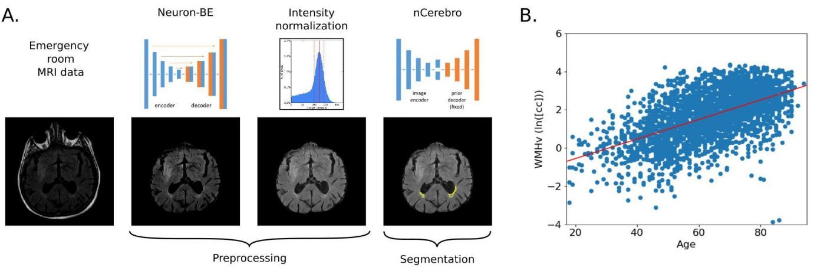

# White matter hyperintensity pipeline

## Goal
We set out to characterize white matter hyperintensity lesions in large scale acute ischemic stroke cohorts.

An overview of the goals and the process of the algorithm can be found here: 
http://markus-schirmer.com/artemis_aim_1.html

See also: 
http://www.resilientbrain.org/mrigenie.html

This is what the pipeline looks like:

## Use restriction
Feel free to use for scientific purposes and please acknowledge our work:

Citation for WMH segmentation: 
[1] Schirmer et al. "White matter hyperintensity quantification in large-scale clinical acute ischemic stroke cohorts–The MRI-GENIE study." NeuroImage: Clinical 23 (2019): 101884.

Citation using brain volume estimates: 
[1] Schirmer et al. "White matter hyperintensity quantification in large-scale clinical acute ischemic stroke cohorts–The MRI-GENIE study." NeuroImage: Clinical 23 (2019): 101884. 
[2] Schirmer et al. "Brain volume: an important determinant of functional outcome after acute ischemic stroke." Mayo Clinic Proceedings. Vol. 95. No. 5. Elsevier, 2020.

The atlas included in this pipeline is from our other work found here: 
[3] Schirmer et al. "Spatial signature of white matter hyperintensities in stroke patients." Frontiers in neurology 10 (2019): 208. 
https://zenodo.org/record/3379848#.ZBMns9LMLcI

## Approach

## Requirements
The project relies on python3 and ANTS (Advanced Normalization ToolS), which need to be installed separately. The required python packages are summarized in the requirements.txt file, which can be used to install everything through pip. I recommend using a virtual environment for that. 

> pip install -r requirements.txt

This project, although developed with the use of GPUs, can be readily evaluated on CPUs only. Should not take much longer than 1min per patient. 

Within nCerebro, please put the following files:

https://www.dropbox.com/sh/ksjfog2cbl69b6s/AAA-hmRb5TYcnLlKsvczuUZ4a?dl=0

in a folder called fixtures

`nCerebro/fixtures`

## Usage

`bash wmhp.sh input_file.nii.gz output_file.nii.gz`

Results and intermediate files (if kept) will be saved in the output file's directory. 

### Input
Clinical FLAIR image (around 1x1x6mm resolution) of stroke patients.

### Output
Main outputs include (not discussing the temprorary files)

Brain mask:  
*_wmh_seg_brainmask_01.nii.gz  

Refined brain mask (combined GM & WM mask mask) 
*_wmh_seg_gmwm_seg.nii.gz  

WMH segmentation 
*_wmh_seg.nii.gz

Log file containing statistics: 
*_wmh_seg_stats.log

-- Statistics include 
--- Rescaling factor: average WM intensity value 
--- GMWM_volume: Combined GM & WM volume (cc) 
--- WMH_volume: WMH volume (cc)

## Environment variables
Within the wmhp.sh

python binary for which all the requirements.txt packages have been installed  
`python_bin=python3`

setting ANTs variables to wherever they are for you.   
`ants_warp_transform=/Packages/ANTs/build/ANTS-build/Examples/WarpImageMultiTransform`   
`ants_registration_quick=/Packages/ANTs/ANTs/Scripts/antsRegistrationSyNQuick.sh`

number of CPU cores to use (this is only utilized for part of the code)   
`num_threads=4`

keeping intermediate files for debugging, including registration results, etc.   
`keep_intermediates=false`

Optional changes   
The very last line of the code in whmp.sh specifies the viewer command. This can be modified to use the viewer of your choice with the appropriate parameters and allows you to just copy and paste the line to look at the results.   

`echo "rview ${raw_img} ${wmh_seg_file} -scontour -res 3 -xy"`